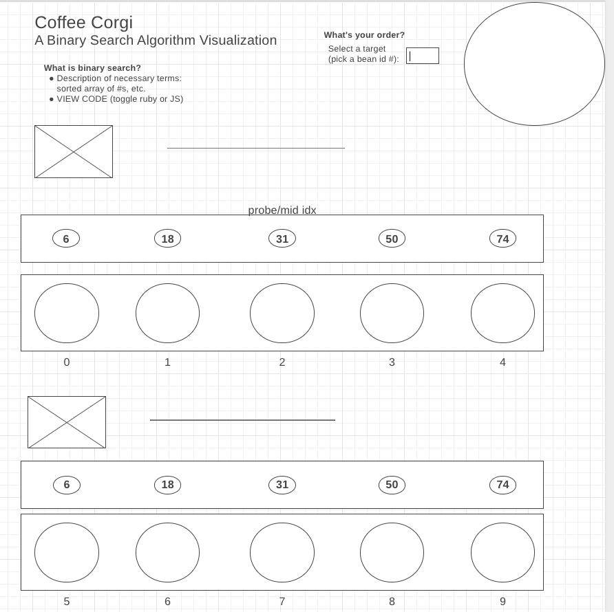

# Coffee Corgi: A Binary Search Algorithm Visualization

Biggo the B-Search Dog will parse through the coffee beans (sorted by bean id #) housed in an array of cups and identify the target coffee bean from the correct mug (index) and fetch it in O(log n) time (logarithmic time complexity). 

## 1. Background and Overview 

* Biggo will go investigate the mid-index mug and determine if the target coffee bean id # is smaller than, equal to, or larger than the bean contained in the mug. 
* Based on that result, Biggo will either repeat the process on the left half or right half; if it's equal Biggo will fetch the bean and return it to the user!

### Notable elements:
* coffee bean id # (uses any numbers but must be sorted from small to large)
* randomly generated coffee bean id #s that are sorted
* mug indices (starts at 0, increments by 1)
* target bean (user selects)
* probe/mid index mug

## 2. Functionality and MVPs 

    In Coffee Corgi, users will be able to:

    [ ] Select a target coffee bean by id #
    [ ] Click a button to start the visualization
    [ ] Watch as Biggo parses through the beans and mugs and finds the mug index with the target coffee bean id
    [ ] Will have 12-mug array option.

    In addition, this project will include:

    [ ] Basic explanation of Binary Search requirements
    [ ] Code example in JS

    1) drew mugs as an execise in Canvas / SVGs
    2) Use canvas to animate the running Corgis

## 3. Wireframes 

## 4. Architecture and Technology 

* Pure JavaScript
* HTML5 Canvas
* CSS
* Webpack

## 5. Implementation Timeline 

### Stage 1
* Research on Canvas and D3.js
* Basic layout outlined
* Class structure outlined

### Stage 2: 
* Basic movement logic outlined
* Layout styled

### Stage 3
* Movement logic refined
* Layout style refined

### Stage 4
* Feature testing 
* Styling

### Stage 5
* Debugging 
* Final styling
* Production README

## 6. (Bonus Features) 
* Insanity level (100-mug array)
* Easter egg button